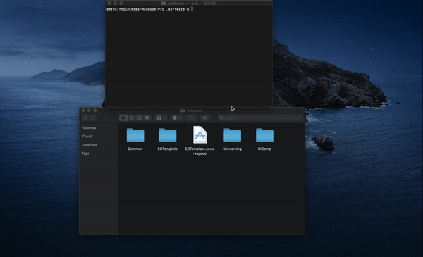

# ECModularStructureTemplate
a horrible ready-to-go modular structure template

## Setup

```bash
$ cd root/directory/docs/scripts
$ chmod +x ./rename.sh
$ ./rename.sh "MyNewProject"
```
 and you're good to go.

## Modular Structure

 

# Preview :star:

 